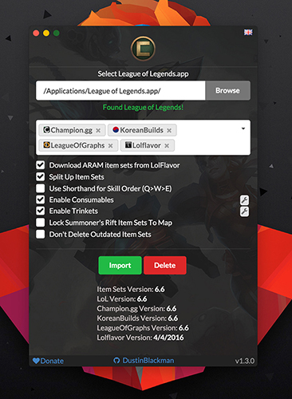

# Championify

_Champion-If-Ayyy_

[](https://salt.bountysource.com/teams/championify)
[](https://gitter.im/dustinblackman/Championify?utm_source=badge&utm_medium=badge&utm_campaign=pr-badge&utm_content=badge)
[](https://doclets.io/dustinblackman/Championify/master)
[](https://travis-ci.org/dustinblackman/Championify/builds)
[](https://ci.appveyor.com/project/dustinblackman/championify/branch/master)
[](https://coveralls.io/github/dustinblackman/Championify?branch=master)
<a href="https://zenhub.io"></a>
[](https://www.transifex.com/dustinblackman/championify)

Latest Release Downloads: [](https://github.com/dustinblackman/Championify/releases/latest)

Championify is a little program that downloads all the recent item sets from popular websites like Champion.gg, Lolflavor, and KoreanBuilds, and imports them in to your League of Legends to use within game! No hassle. Championify supports 39 languages and with plenty of new features planned and in the works!

Windows and OSX are both supported, tested on Windows 10 and OSX 10.11.3.



Check out screenshots [here](https://imgur.com/a/vgS3I)!

There's also [Championify for Android](https://github.com/OmerValentine/Championify-Android)!

---

## Features
- Summoners Rift and ARAM Item Sets
- 3 Sources (Champion.gg, LolFlavor, and KoreanBuilds)
- Skill Priorities lists (Q.W.E.Q.E.R) or Q>E>W
- 39 Languages
- Bunch of preferences to display item sets in the way you prefer
- Automation using command line preferences (simpler system coming soon)
- Automatically save preference settings
- Garena support
- Does not touch other item sets that you or other applications create


## Downloads
Found [here](https://github.com/dustinblackman/Championify/releases/latest)


## [Change Log](CHANGELOG.md)

<a name="1.3.4" />
### 1.3.4 (July 28th, 2016)

#### Bug Fixes
- Lolflavor is dead, remove from the app
- Verify sources exist in code base before processing
- Fix KoreanBuilds scraper to show proper titles and split blocks
- Add trinkets to Korean Builds
- Fix missing blue trinket from all item sets


## Idea/Suggestions
I'm completely open to new ideas and suggestions! Put up an [Issue](https://github.com/dustinblackman/Championify/issues), hit me up on [Gitter](https://gitter.im/dustinblackman/Championify), or send me a message on reddit [/u/dustinheroin](https://www.reddit.com/user/dustinheroin) and I'll see what I can do.

## Contribute
Please see [CONTRIBUTE.md](CONTRIBUTE.md)

## [FAQ](FAQ.md)
See [FAQ.md](FAQ.md)

## Future Plans
Check out the [Features tag in Issues](https://github.com/dustinblackman/Championify/labels/feature) to see all up and  coming ideas.

<a name="clp" />
## Command Line Parameters
Championify supports a few command line parameters for those who would like to automate a few tasks before it's official supported within the app. Params work on both Windows and OSX, and uses the last saved preferences made on the app (preferences are saved each time you hit import). The command line prefs do need improvement and can be tracked [here](https://github.com/dustinblackman/Championify/issues/165).

__Params__

- `--import` Imports item sets
- `--delete` Deletes item sets
- `--autorun` Silently (without loading the UI) imports item sets
- `--close` Closes Championify when finished
- `--startLeague` Starts League of Legends after import

__Example__

Silently imports and starts League afterwards.

```bash
C:/Championify/championify.exe --autorun --startLeague
```


## Bleeding Edge
For the adventurous, bleeding edge builds are available of each branch through CIs. A simpler method will be available once a website is built.

__Windows__

Open [Appveyor](https://ci.appveyor.com/project/dustinblackman/championify/branch/master) and select the the latest master branch commit, then `Platform: x86`, then `artifacts`. You'll find `download.txt` that contains a Zippyshare link to the build off that commit.

__OSX__

Open [Travis](https://travis-ci.org/dustinblackman/Championify/branches) and select the the latest master branch commit, scroll down through the test log until you see `npm run build-artifact`, a few lines down you should see a Zippyshare link to the build off that commit.


<a name="source" />
## Build From Source
You must have Node 4.1.1 and NPM 3.8.5 installed on your system (thats what Electron is using), git clone the repo and run the following in the root folder.

__OSX:__
```console
npm i
npm run build
```

__Windows:__
```console
npm i --arch=ia32
npm run build
```

You'll find a Championify.exe/Championify.app in the releases folder.

Wine is required if building on Mac for Windows.
```console
brew install wine
```

## [Donate](https://salt.bountysource.com/teams/championify)

Soon Championify will be expanding, big! With plenty of suggestions and new ideas, Championify will be making it's way to the web and mobile. This will unfortunately have server costs in order to get started and keep running. A couple bucks is more then enough to help! :) [Donate here!](https://salt.bountysource.com/teams/championify)

## Backers

See [BACKERS.md](BACKERS.md)

## Credit
- Icon by [Omer Levy](http://github.com/OmerValentine)
- [Joeldo](https://www.reddit.com/user/joeldo) of [Champion.gg](http://champion.gg)
- [KoreanBuilds](http://koreanbuilds.net)


## Thank yous
- [@sargonas](https://github.com/sargonas) and the rest of the Riot API team for unlocking item sets
- All the wonderful people on my [Transifex team](https://www.transifex.com/dustinblackman/championify/) (all 180 of you) for helping translate Championify!


## [License](LICENSE)

Championify isn't endorsed by any of it's content sources or Riot Games and doesn't reflect the views or opinions of them or anyone officially involved in producing or managing League of Legends. League of Legends and Riot Games are trademarks or registered trademarks of Riot Games, Inc. League of Legends © Riot Games, Inc.
