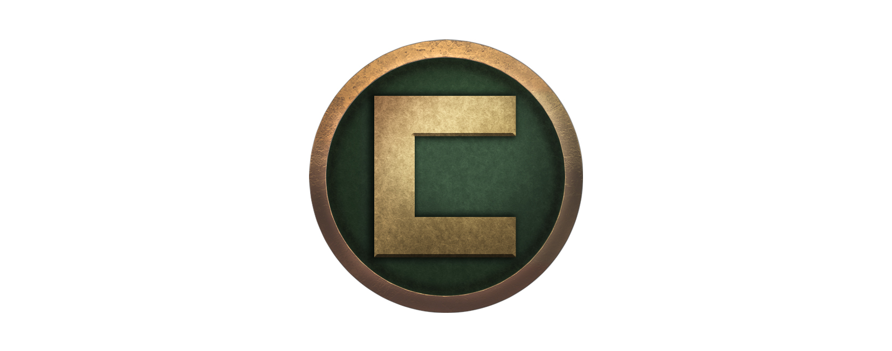
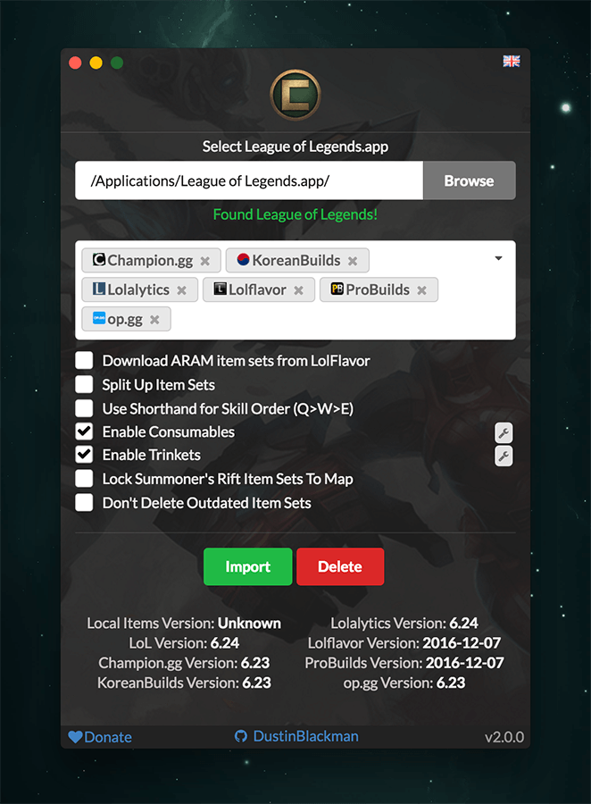

# Championify

_Champion-If-Ayyy_

[](https://patreon.com/dustinblackman)
[](https://doclets.io/dustinblackman/Championify/master)
[](https://travis-ci.org/dustinblackman/Championify/builds)
[](https://ci.appveyor.com/project/dustinblackman/championify/branch/master)
[](https://coveralls.io/github/dustinblackman/Championify?branch=master)
[](https://www.transifex.com/dustinblackman/championify)

__Project on hiatus.__ https://dustinblackman.com/posts/2019/05/hiatus-from-open-source/

Latest Release Downloads: [](https://github.com/dustinblackman/Championify/releases/latest)

Championify is a little program that downloads all the recent item sets from popular websites like Champion.gg and imports them in to your League of Legends to use within game! No hassle. Championify supports 39 languages and with plenty of new features planned and in the works!

Windows and OSX are both supported, tested on Windows 10 and OSX 10.12.1.

__NOTE__: All Championify clients before version 2.0.0 no longer work. Please download the latest version from the [releases](https://github.com/dustinblackman/Championify/releases/latest) page.



Check out screenshots [here](https://imgur.com/a/vgS3I)!

There's also [Championify for Android](https://github.com/OmerValentine/Championify-Android)!

[Code Sponsor](https://app.codesponsor.io/link/owV5qUw9JoSRvTBFtixp6Xui/dustinblackman/Championify)

---

## Features
- Summoners Rift and ARAM Item Sets
- 7 Sources (Champion.gg, LolFlavor, KoreanBuilds, op.gg, Lolalytics, Probuilds, and Lolmasters)
- Skill Priorities lists (Q.W.E.Q.E.R) or Q>E>W
- 41 Languages
- Bunch of preferences to display item sets in the way you prefer
- Automation using command line preferences (simpler system coming soon)
- Automatically save preference settings
- Garena support
- Does not touch other item sets that you or other applications create


## Downloads
Found [here](https://github.com/dustinblackman/Championify/releases/latest)

## [Change Log](CHANGELOG.md)

## Idea/Suggestions
I'm completely open to new ideas and suggestions! Put up an [Issue](https://github.com/dustinblackman/Championify/issues), hit me up on [Gitter](https://gitter.im/dustinblackman/Championify), or send me a message on reddit [/u/dustinheroin](https://www.reddit.com/user/dustinheroin) and I'll see what I can do.

## Contribute
Please see [CONTRIBUTING.md](./.github/CONTRIBUTING.md)

## [FAQ](FAQ.md)
See [FAQ.md](FAQ.md)

## Future Plans
Check out the [Features tag in Issues](https://github.com/dustinblackman/Championify/labels/feature) to see all up and coming ideas.

## Command Line Parameters
Championify supports a few command line parameters for those who would like to automate a few tasks before it's official supported within the app. Params work on both Windows and OSX, and uses the last saved preferences made on the app (preferences are saved each time you hit import). The command line prefs do need improvement and can be tracked [here](https://github.com/dustinblackman/Championify/issues/165).

__Params__

- `--import` Imports item sets
- `--delete` Deletes item sets
- `--autorun` Silently (without loading the UI) imports item sets
- `--close` Closes Championify when finished
- `--start-league` Starts League of Legends after import

__Example__

Silently imports and starts League afterwards after installing Championify with the Windows Installer. As Squirrels
generates the main `championify.exe`, `--processStartArgs` must be used before all other command line options.

```cmd
C:\Users\YOURNAME\AppData\Local\Championify\championify.exe --processStartArgs --autorun --start-league
```

<a name="source" />

## Build From Source
You must have Node 6.9.1 and npm 3 installed on your system (thats what Electron is using), git clone the repo and run the following in the root folder.

__OSX:__
```bash
npm i
npm run build
```

__Windows:__
```bash
npm i --arch=ia32
npm run build
```

You'll find a Championify.exe/Championify.app in the releases folder.

Wine is required if building on Mac for Windows.
```bash
brew install wine
```

## [Donate](https://patreon.com/dustinblackman)

Championify continues to grow, and to help explore bigger ideas, there is always costs. Currently Championify costs a couple hundred dollars a year to keep going (certificates renewal). A couple bucks is more then enough to help! :) [Donate here!](https://patreon.com/dustinblackman). To learn how to do one time donations with Patreon, see [here](https://patreon.zendesk.com/hc/en-us/articles/204606215-Can-I-make-a-one-time-payment-).

## Backers

See [BACKERS.md](BACKERS.md)

## Credit
- Icon by [Omer Levy](http://github.com/OmerValentine)
- Package icon by [Becris](http://www.flaticon.com/free-icon/new-product_166913#term=new&page=2&position=96)
- [Joeldo](https://www.reddit.com/user/joeldo) of [Champion.gg](http://champion.gg)
- [Lolflavor](http://www.lolflavor.com/)
- [KoreanBuilds](http://koreanbuilds.net)
- [Probuilds](http://probuilds.net)
- [Lolalytics](http://lolalytics.com)
- [op.gg](http://op.gg)
- [Lolmasters](http://lolmasters.net/)

## Thank yous
- [@sargonas](https://github.com/sargonas) and the rest of the Riot API team for unlocking item sets
- All the wonderful people on my [Transifex team](https://www.transifex.com/dustinblackman/championify/) (all 180 of you) for helping translate Championify!


## [License](LICENSE)

Championify isn't endorsed by any of it's content sources or Riot Games and doesn't reflect the views or opinions of them or anyone officially involved in producing or managing League of Legends. League of Legends and Riot Games are trademarks or registered trademarks of Riot Games, Inc. League of Legends © Riot Games, Inc.
